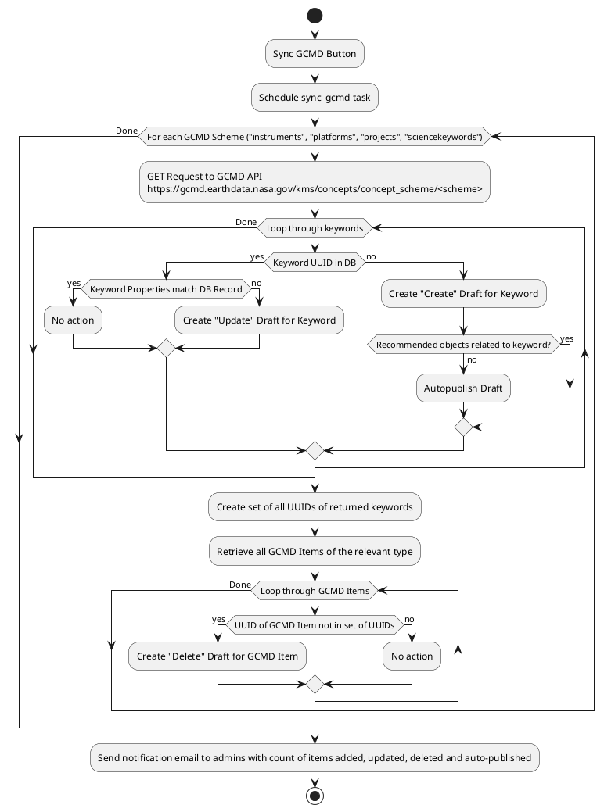
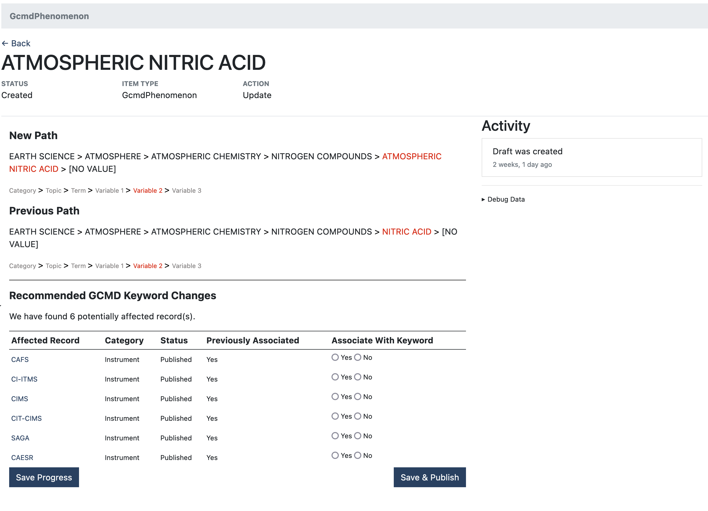

# 4. GCMD Sync Technical Implementation

- Status: Accepted
- Deciders: @JohnHedman @alukach
- Date: 2022-09-14

Technical Story: [#297](https://github.com/NASA-IMPACT/admg-backend/issues/297)

## Context and Problem Statement

This ADR documents the implementation of this feature. For the design and decision drivers, see [ADR #2](./0002-gcmd-sync-design-process.md).

## Workflow

### Background processing

The GCMD Sync background process fetches items from the GCMD Keyword Management Service API and compares them to records in our database. If items are new, they are added as a Create Draft. If they are already present in the DB, but have been modified, an Update Draft is created. If any items in the DB are no longer available through the KMS API, a Delete Draft is created.

### Interface

After GCMD Keywords have been synced, admins can review the proposed changes at `/gcmd_list/draft`. Reviewers can view each proposed keyword change and make note of any changes. They can also review CASEI models (Campaigns, Platforms, Instruments) associated with the keyword (referred to as Affected Records) and indicate whether to continue associating each model with that keyword. Once all Affected Records have been addressed, the reviewer can publish the changes.

## Components

### Asynchronous Tasks

This system consists of two asynchronous Celery tasks:

1. `sync_gcmd` is the main process that interacts with the GCMD Keyword Management Service API (https://gcmd.earthdata.nasa.gov/kms/) and the MI database. This task is currently run manually, but could be configured to run on a schedule.

2. `email_gcmd_sync_results` is scheduled at the end of a successful `sync_gcmd` run and sends a notification by email to MI administrators with the results of the sync.

### GcmdSync Class

Every run of the GCMD Sync process creates a `GcmdSync` object for each `gcmd_scheme` ("instruments", "projects", "platforms", "sciencekeywords"). Each object fetches the keyword list for its scheme and processes it according to the [Background Processing Workflow above](#background-processing-workflow). The object stores lists of created, updated, deleted and auto-published keywords, which are then used in the `email_gcmd_sync_results` task.
