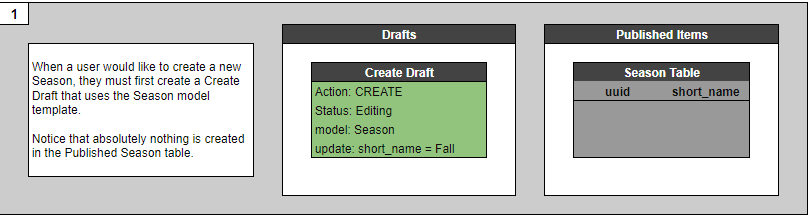
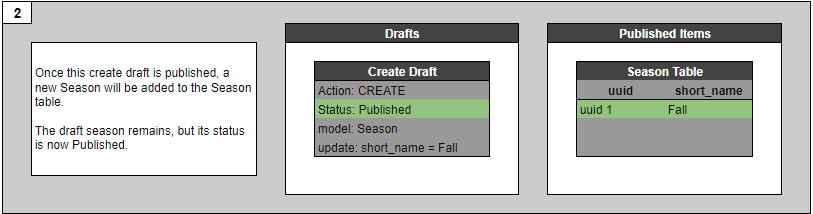
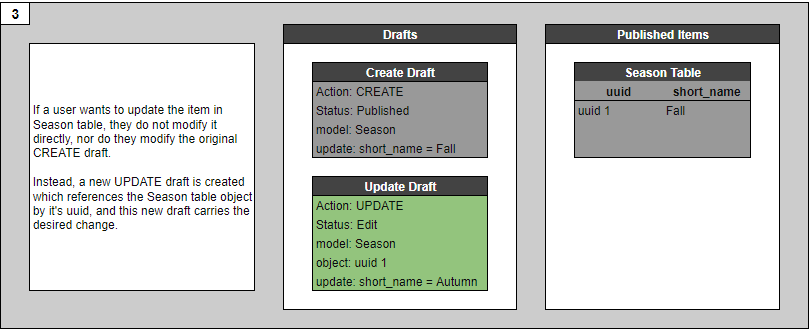
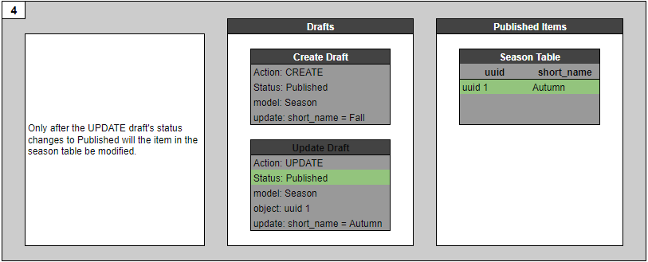
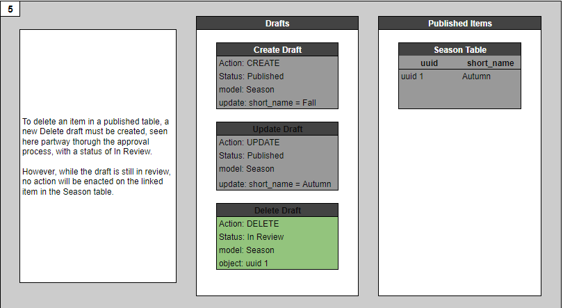
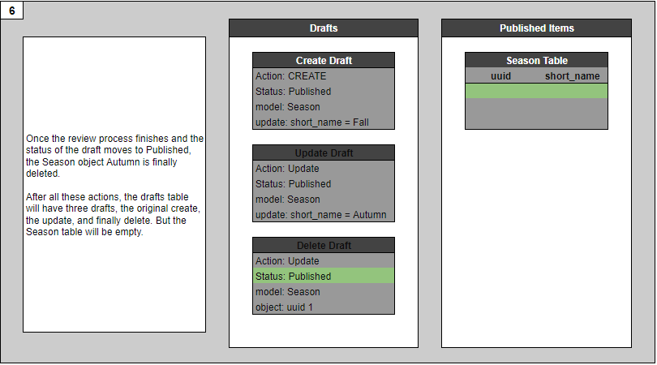

Understanding the Change Objects
================================

# Overview
In the CASEI database all objects start as drafts. While they are in a draft state they are considered Change objects based upon different a "Action" they go through. 
The three actions a change object can be a "Create", "Update", or "Delete." When a draft is created its action is "Create." 
When a draft is published then updated a new change object is generated based upon the action "Update." 
Finally the same concept applies to deleting a draft. The change object is now a Delete draft but is removed from the database. 

Please follow the Draft Creation Process diagram below to find more info on drafts and change objects.

