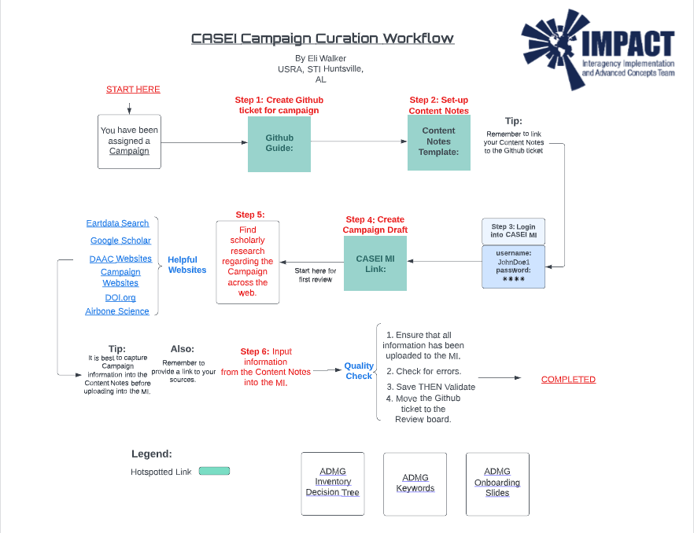

Curation Interface
==================

In the introduction to CASEI we mentioned that all inventory content is entered and updated in the Maintanence Interface (MI) through a curation process. Here users can 
view this entire process in detail. 

All of NASA's airborne science information exists independently and separately online. The process of compiling, reviewing, and publishing in the MI links all information together thus creating contextual metadata in our database and Catalog of Archived Suborbital Earth Science Investigations website. 

All objects start as drafts which can create, update, or delete a published object

For this example we will show the curation of a NASA campaign. 

Users can use this link as a reference for inventory terms and definitions.

`<https://docs.google.com/document/d/1sHxrqtC2k-X4ETvoes9ORlpclrOOrtE70OHmerGADZM/edit>`_

Compiler Process
----------------

Compiling
+++++++++
Step 1: First curators compile campaign information across different authoritative sources (i.e. scientific journals, presentations, NASA websites, etc.) into a document. 

Step 2: Curators take the collected information and inputs it into different metadata fields in the MI. Thus creating a *campaign draft*.

Step 3: During NASA campaigns different types of platforms are deployed along with instruments to collect data. Through intventory terms and consistant definitions the Airborne Data Management Group views this as viable information that is related to the campaign. Curators input this information into different metadata fields related to the Deployment that was conducted, the Intensive Operation Period where instrument(s) and platform(s) operate with the goal of observing phenomena in support of the campaign, any Significant Events that happened during the campaign, then they link C-D-P-I's (Campaign, Deployment, Platform, and Instruments) together.

Step 4: The curator runs the DOI fetcher that collects campaign DOI's.

Step 5: Next curators validate each field and saves the draft.

Step 6: Then submits the draft to transfer for a Staff Review thus changes the status to "Awaiting Review."

Staff Review
++++++++++++

Step 1: Next another ADMG curator claims the draft for a Staff Review. Changing the status to "In Review."

Step 2: Next the ADMG curator performs a quality check by reviewing the compiler's content notes and the fields within the MI. Here the reviewer edits any errors or adds more information.

Step 3: Next the reviewer submits the draft for an Admin Review. The status is now "Awaiting Admin Review"

Admin Review
++++++++++++

Step 1: Finally a different curator claims the Admin Review. Status is now "Under Admin Review."

Step 2: The admin reviewer does a throrough quality check of each field, adds an admin description, verify that all links work, and check each dependent drafts.  

Step 3: Publishes campaign dois if there are any collected.

Step 4: Then publishes the metadata. Now users have a campaign that is "Published."

